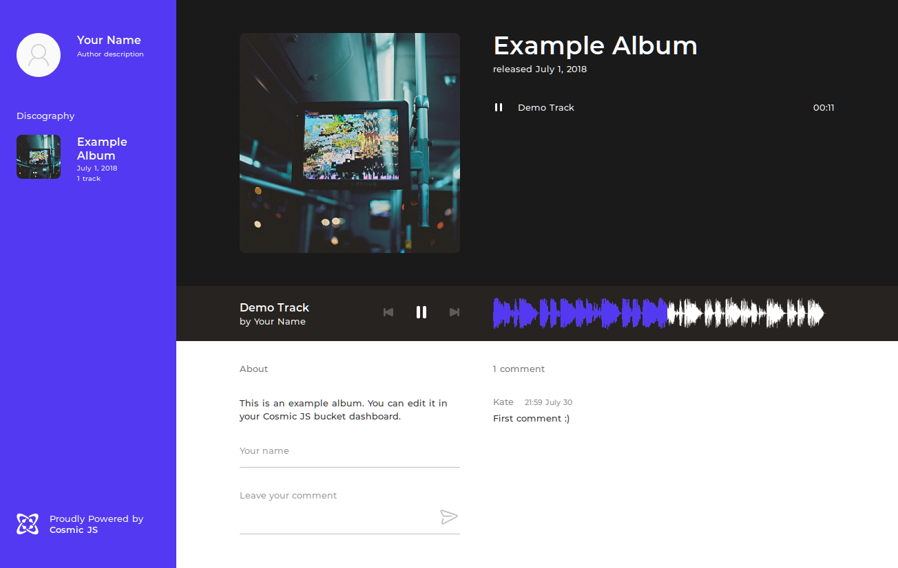

# Vue.js Music Website



### [View Demo](https://mymusicplaylist21.netlify.app/)

.

## How to

### Prepare your Cosmic JS bucket

Import example [bucket.json](bucket.json) to your Cosmic JS bucket.

### Clone this repository

``` bash
https://github.com/Annamaria9-coder/MyMusic-Playlist.git
cd MyMusic-Playlist
```

### Configure

Edit `instance.config.js` to adjust app colors if you need.

You can see that Cosmic JS access credentials are picked up from the next environment variables:

```
COSMIC_BUCKET
COSMIC_READ_KEY
COSMIC_WRITE_KEY
```

### Setup and run

``` bash
# install dependencies
$ npm install # Or yarn install

# serve with hot reload at localhost:3000
$ npm run dev

# build for production and launch server
$ npm start

# generate static project
$ npm run generate
```

This app is based on Nuxt.js.
For detailed explanation on how things work, checkout the [Nuxt.js docs](https://github.com/nuxt/nuxt.js).

